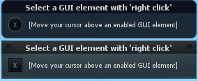
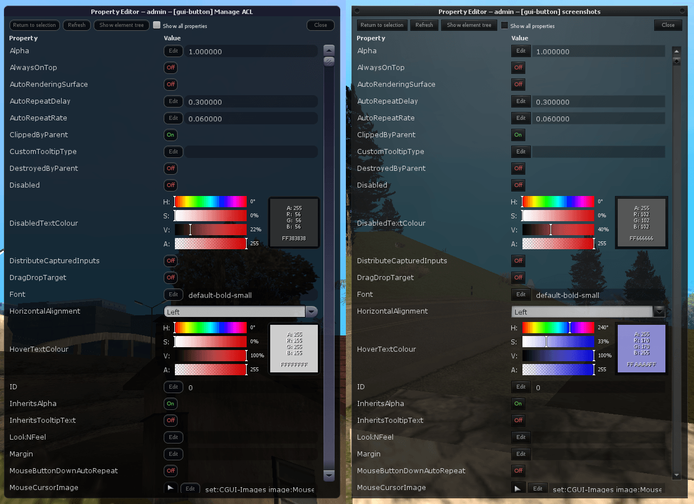
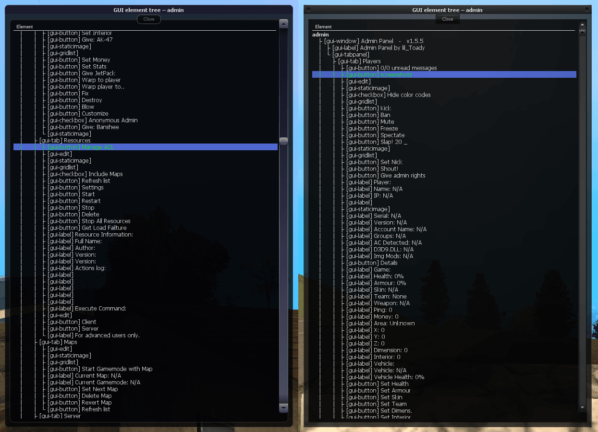

# Property Editor
(CE)GUI property editor resource for the Multi Theft Auto: San Andreas multiplayer.

**Note:** Don't use this tool on a production server, because for example any button, which is disabled if you shouldn't have access to a certain feature, can be re-enabled by this tool.

## How to use
1. Add the resource to your server
2. Give the developers the ACL permission to use `command.propertyeditor`
3. Refresh the server and start `propertyeditor`
4. Type `/propertyeditor` to show the selection
5. Select a GUI element on your screen with 'right click'
6. Edit the properties of the selected element

## Requirements
- Players require the ACL permission for `command.propertyeditor`

## Screenshots
### Selector

### Editor

### Element tree

